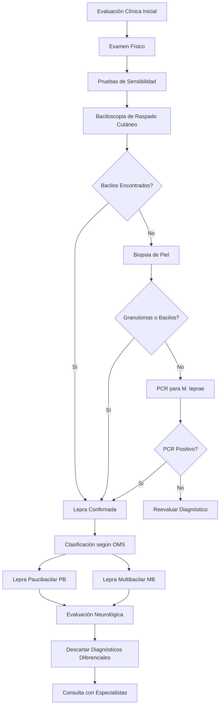

```mermaid
graph TD
A[Evaluación Clínica Inicial] --> B[Examen Físico]
B --> C[Pruebas de Sensibilidad]
C --> D[Baciloscopia de Raspado Cutáneo]
D --> E{Bacilos Encontrados?}
E --> |Sí| F[Lepra Confirmada]
E --> |No| G[Biopsia de Piel]
G --> H{Granulomas o Bacilos?}
H --> |Sí| F
H --> |No| I[PCR para M. leprae]
I --> J{PCR Positivo?}
J --> |Sí| F
J --> |No| K[Reevaluar Diagnóstico]
F --> L[Clasificación según OMS]
L --> M[Lepra Paucibacilar PB]
L --> N[Lepra Multibacilar MB]
M & N --> O[Evaluación Neurológica]
O --> P[Descartar Diagnósticos Diferenciales]
P --> Q[Consulta con Especialistas]
```
